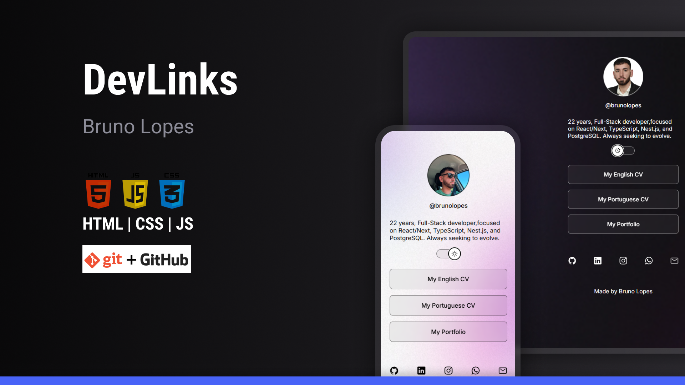
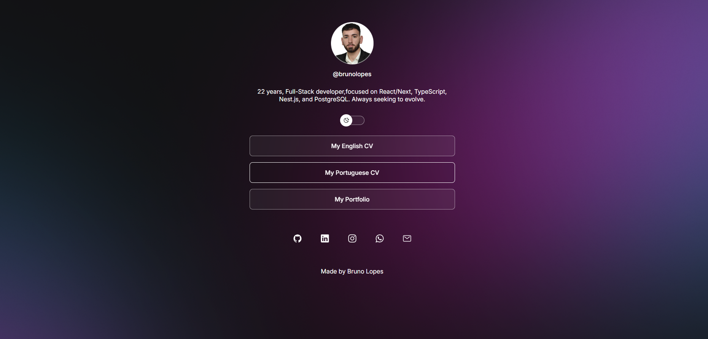

<h1 align="center"> DevLinks </h1>

Personal project developed for front-end developer training

 

  

  

  

## 🚀 Technologies

This project was developed with the following technologies:

- HTML | CSS
- JavaScript
- Git | Github

## 💻 Project

DevLinks is a link aggregator that can be used as an online business card.

TESTE HERE -> https://brunolopes9.github.io/DevLinks/ 

---

Made with ♥ by Bruno Lopes
